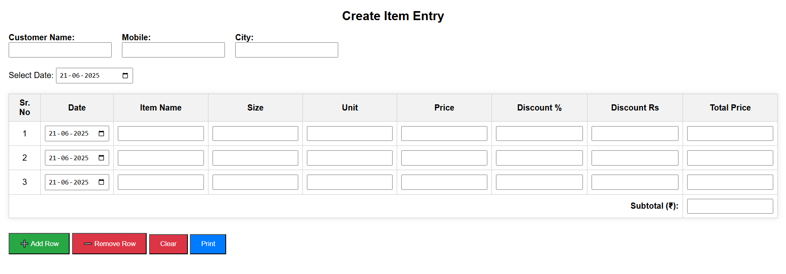

# 🧾 Item Entry & Printable Billing System

A lightweight, browser-based billing tool for small retailers and hardware shops. Built with HTML, CSS, and JavaScript to generate instant, printable invoices.

## 🔧 Technologies Used
- HTML5
- CSS3 (with responsive print layout)
- Vanilla JavaScript

## ✅ Features
- Dynamic row add/remove
- Auto subtotal with discount logic (₹ / %)
- Global date fill for all items
- Real-time subtotal in digits & Indian words
- Print-optimized layout with business branding
- One-click clear/reset

## 📸 Screenshot

## 🖨️ Use Case
Perfect for small businesses who need simple, no-login, printable billing without a backend.

## 🌐 Live Demo
👉 [Click here to view](https://sachinp72.github.io/item-billing-app/)

## 🙋‍♂️ Author
Developed by [Sachin Potre](https://github.com/sachinp72)

